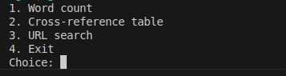
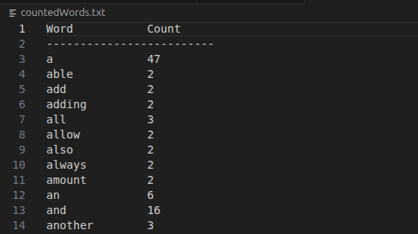
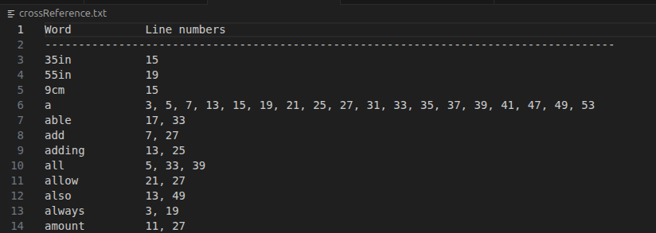
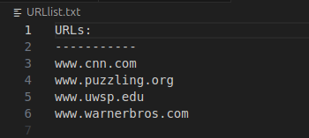

# papildoma_uzduotis
Egzamino (išankstinė) užduotis

# Skaičiavimas kiek kartų kievienas skirtingas žodis pasirodo tekste

Užduočiai buvo pasirinktas BBC straipsnis [How maths can help you wrap your presents better](https://www.bbc.com/future/article/20251212-how-maths-can-help-you-wrap-your-presents-better). Tekstas nukopijuotas į txt failą.  

Užduočiai pasirinktas `std::map`, nes jis leidžia patogiai saugoti skirtingus žodius kaip raktus ir jų pasikartojimų skaičių kaip reikšmes ( ["žodis" : "pasikartojimų skaičius"] ). `std::map` neleidžia raktams dubliuotis, todėl saugomi tik unikalūs žodžiai.  

# Cross-reference lentelė
Šiai užduočiai atlikti buvo naudotas `std::map` sprendimas iš WordCount.cpp, kad surasti unikalius žodžius ir jų kartojimosi reikšmę (kadangi užduotis reikalauja į lentelę įterpti tik žodius, kurie kartojasi daugiau nei 1 kartą).  
Taip pat buvo naudojamas `std::map` konteineris su `std::set` eilučių numeriams saugoti.`std::set` neleidžia pasikartojančių reikšmių ir automatiškai rikiuoja reikšmes didėjimo tvarka, todėl nereikia papildomo tikrinimo ar rūšiavimo išvedimo metu.

# URL adresų suradimas tekste
Užduočiai buvo pasirinktas straipsnis ['I know about hit songs, hit numbers, hit sounds': The man who turned The Beatles into superstars](https://www.bbc.com/culture/article/20250820-the-man-behind-the-beatles-brian-epstein). Tekstas nukopijuotas į txt failą.  
Šiai uzduoties daliai buvo naudojamas `std::set` konteineris, neleidžia pasikartojančių reikšmių ir automatiškai surikiuoja URL adresus abėcėlės tvarka.  

## Kaip veikia programa
Paleidus programą vartotojas mato meniu.  
  

Suvedus ***1.*** programa sugeneruoja failą su žodžiais ir jų pasikartojimo skaičiumi.  
  

Suvedus ***2.*** programa sugeneruoja failą su cross-reference tipo lentele. Joje nurodytas žodis ir kuriose teksto eilutėse jį galima rasti.  
 

Suvedus ***3.*** programa sugeneruoja failą su URL adresų sąrašu.  

Suvedus ***4.*** programa baigia darbą.  